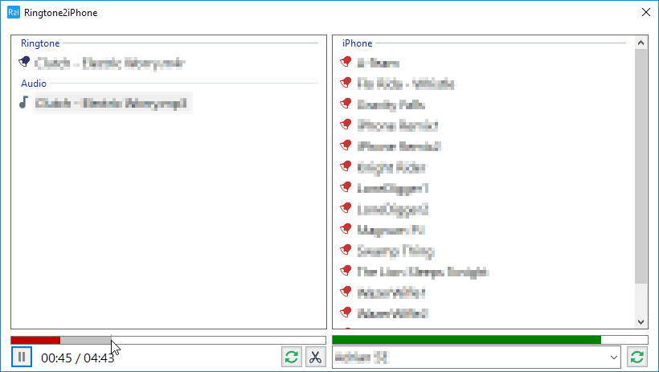
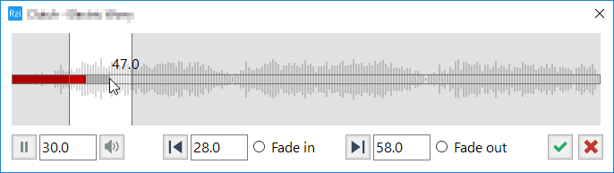

Ringtone2iPhone (alpha)
=======================

This app is created for my eleven-year-old daughter who loves his iPhone and often nags me to create and/or upload ringtones to her phone.

The audio files are stored in the `Audio` folder.

Download
--------

Check out the [releases](https://github.com/ZalaPanda/Ringtone2iPhone/releases) section.
> IMPORTANT!  
> The program modifies the `Ringtones.plist` file on the phone. The added ringtones are available instantly (no reboot needed) but the compatibility with **iTunes** is not tested yet. Ignore this warning if you don't use iTunes.

HOWTO
-----

Soon...

TODO
----
Things I plan to fix:
* Select added items in lists.
* Get rid of [libimobiledevice](https://github.com/libimobiledevice/libimobiledevice) wrapper to reduce size.
* Some kind of logging?
